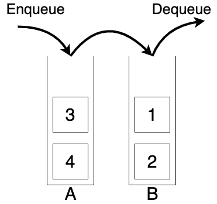

# Stack으로 Queue 구현하기


## 방법



### Enqueue

첫 번째 스택인 A에 Push해준다.


### Dequeue

1. 두 번째 스택인 B가 비어 있다면
   * 첫 번째 스택인 A가 빌때까지 A를 pop하면서 두 번째 스택인 B에 push한다.
2. 두 번째 스택인 B가 비어 있지 않다면
   * 두 번째 스택인 B에 있는 값을 pop하면 된다.


## 코드

```java
public class StackQueue<T> {

    Stack<T> A;
    Stack<T> B;

    public StackQueue() {
        A = new Stack<>();
        B = new Stack<>();
    }

  	// enqueue
    public void enqueue(T data) {
        A.push(data);
    }

  	// dequeue
    public T dequeue() {
        if(B.isEmpty()) { // B가 비어있다면
            while(!A.isEmpty()) { // A의 모든 값을 B로 Push
                B.push(A.pop());
            }
        }
        return B.pop(); // B를 pop
    }

    public boolean isEmpty() {
        if(A.isEmpty() && B.isEmpty())
            return true;
        else
            return false;
    }
}
```

```java
public class Main {

    public static void main(String[] args) {

        StackQueue<Integer> queue = new StackQueue<>();

        queue.enqueue(1);
        queue.enqueue(2);
        queue.enqueue(3);
        queue.enqueue(4);

        while(!queue.isEmpty())
            System.out.println(queue.dequeue());
    }
}
// 결과
1
2
3
4
```

